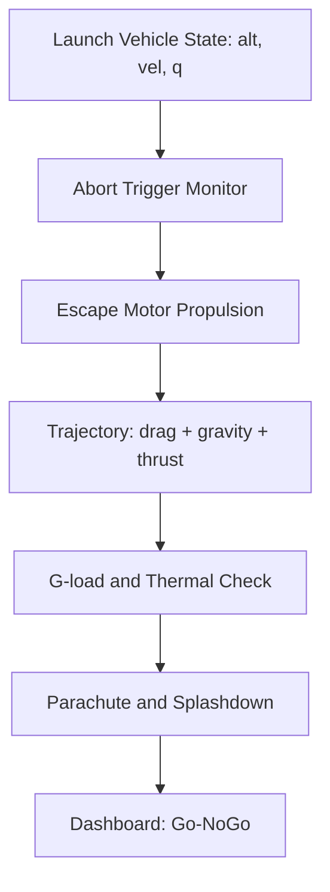

# Gaganyaan Crew Escape Simulator (Gaganyaan-Crew-Escape-Simulator)

> NASA-level launch abort and crew safety simulator for Gaganyaan-class missions. Pad abort, in-flight abort, G-loads, thermal, parachute, splashdown.

   

## Overview
Simulates crew escape from pad to orbit insertion. Validated against Apollo LES and SpaceX Dragon abort logic, adapted for HLVM3.

## Problem Statement
Crew safety requires millisecond abort decisions across dynamic pressure, heating, and G-load constraints. Existing tools are closed or low-fidelity.

## Solution Architecture


## Visuals
Heavy visuals in `app/index.html`: 3D trajectory (Three.js), G-load timeline (Chart.js), abort corridor heatmap, system diagram (Mermaid).


## Quick Start
```bash
git clone https://github.com/kv-creates/Gaganyaan-Crew-Escape-Simulator.git
cd Gaganyaan-Crew-Escape-Simulator
python -m venv .venv && .venv\Scripts\activate
pip install -r requirements.txt
python -m src.main --demo
# open app/index.html for visuals
```

## API
```bash
GET /health
POST /abort
GET /visual-data
```

## Tests
```bash
pytest -q
```

## References
- NASA Human Rating Requirements
- ISRO Gaganyaan press kits
- Sutton, Rocket Propulsion Elements

## License
MIT - kv-creates 2026
