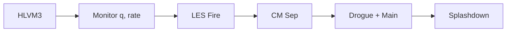

# Architecture

Pad LES + canard + parachute. 3DOF ascent, abort motor 800kN, 8s burn.

```mermaid
flowchart LR
  LV[HLVM3] --> MON[Monitor q, rate] --> LES[LES Fire] --> SEP[CM Sep] --> CHUTE[Drogue + Main] --> SEA[Splashdown]
```
